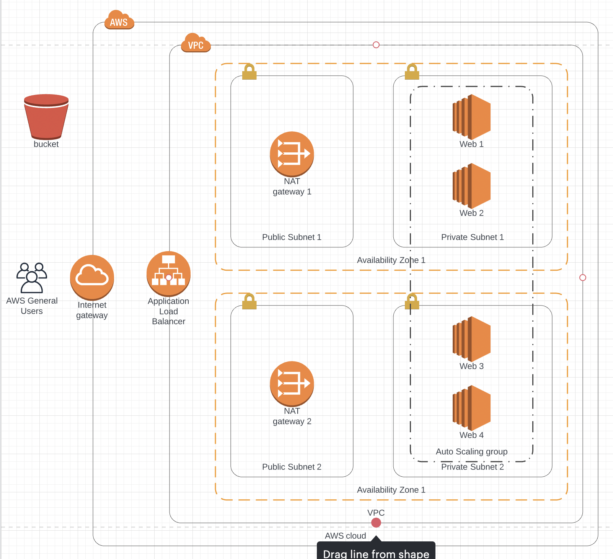

# Web App Cloudformation
A simple web application deployed on AWS using cloudformation. This project does not focus on creating a web application but rather how to deploy it on AWS and autoscale it according to the traffic. For this purpose, EC2 instances are running in an auto scaling group. To expose the application to the world, an Application Load Balancer is attached to the Auto Scaling group.

## Architecture
<p align="middle">
  
</p>

As it can be seen the EC2 instances (Web servers) are deployed in a private subnets to make sure they are not accessible publically. The application is also deployed in two different Availability Zones for high availability.

## Prerequisites
AWS Command Line Interface (AWS CLI) need to be installed and configured in order to run this application
* Follow [this](https://docs.aws.amazon.com/cli/latest/userguide/getting-started-install.html) guide to install AWS CLI.
* Follow [this](https://docs.aws.amazon.com/cli/latest/userguide/cli-configure-quickstart.html) guide to configure AWS CLI.

## How to run
* Upload your zipped build archive to the S3 bucket. A sample hello world build archive is included [here](./project-archive.zip).
* Create network for the application which includes creating VPC, subnets, NAT gateway, Internet gateway etc.
```bash
aws cloudformation deploy \
  --template-file network.yml \
  --stack-name <stack-name-for-network> \  # e.g. my-network
  --parameter-overrides EnvironmentName=<enviroment-name>  # e.g. MyEnvironment
```
You can read more about cloudformation deploy [here](https://docs.aws.amazon.com/cli/latest/reference/cloudformation/deploy/index.html).

* Next step is to deploy our application on EC2 instances in our network. Run the following command to deploy your application on EC2 instances behind a load balancers
```bash
aws cloudformation deploy \
  --template-file servers.yml \
  --stack-name <stack-name> \  e.g. my-servers
  --parameter-overrides EnvironmentName=<same-environment-name-as-networks> \
    AMIId=<ami-id> \
    S3Bucket=<S3-bucket-containing-build-archive> \
    ArchivePath=<archive-path-in-S3-bucket> \
  --capabilities "CAPABILITY_IAM" "CAPABILITY_NAMED_IAM"
```
  * **Note:** The EnvironmentName should be the same as used while creating the network.
  * **AMIId:** The application is meant to be deployed on Ubuntu 18.04. To find the correct AMI for your region, refer [this](https://cloud-images.ubuntu.com/locator/ec2/).
  * **ArchivePath**: Refers to the path of the archive in S3 bucket. Defaults value: archives/project-archive.zip

**Tip:** Both [network.yml](./network.yml) and [servers.yml](./servers.yml) support many more parameters like changing the minimum and maximum number of EC2 instances that can be deployed. These parameters can be found in each file after description.

## Contact
You can get in touch with me on LinkedIn: [Farhan Shoukat](https://www.linkedin.com/in/farhan-shoukat/)

## License
[MIT](./LICENSE) Copyright (c) 2022 Farhan Shoukat